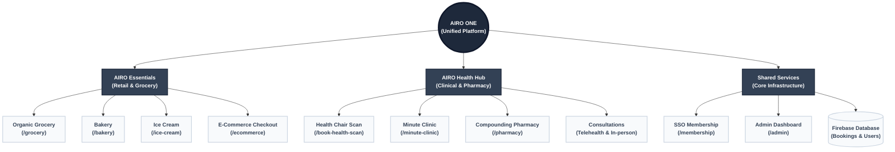

# AIRO ONE - Visual Site Architecture

You can share this visual flowchart with your team! (If you are viewing this in your editor's Markdown Preview, it will render as a beautiful tree diagram).

```mermaid
graph TD
    %% Root Node
    Root(("AIRO ONE\n(Unified Platform)"))

    %% Main Branches
    Root --> Essentials["AIRO Essentials\n(Retail & Grocery)"]
    Root --> Health["AIRO Health Hub\n(Clinical & Pharmacy)"]
    Root --> Shared["Shared Services\n(Core Infrastructure)"]

    %% AIRO Essentials Branch
    Essentials --> E_Grocery["Organic Grocery\n(/grocery)"]
    Essentials --> E_Bakery["Bakery\n(/bakery)"]
    Essentials --> E_IceCream["Ice Cream\n(/ice-cream)"]
    Essentials --> E_Shop["E-Commerce Checkout\n(/ecommerce)"]

    %% AIRO Health Hub Branch
    Health --> H_Scan["Health Chair Scan\n(/book-health-scan)"]
    Health --> H_Clinic["Minute Clinic\n(/minute-clinic)"]
    Health --> H_Pharm["Compounding Pharmacy\n(/pharmacy)"]
    Health --> H_Tele["Consultations\n(Telehealth & In-person)"]

    %% Shared Services Branch
    Shared --> S_Auth["SSO Membership\n(/membership)"]
    Shared --> S_Admin["Admin Dashboard\n(/admin)"]
    Shared --> S_DB[("Firebase Database\n(Bookings & Users)")]

    %% Styling
    classDef root fill:#1e293b,stroke:#0f172a,stroke-width:4px,color:#fff,font-weight:bold
    classDef branch fill:#334155,stroke:#1e293b,stroke-width:2px,color:#fff,font-weight:bold
    classDef leaf fill:#f8fafc,stroke:#cbd5e1,stroke-width:2px,color:#334155

    class Root root
    class Essentials,Health,Shared branch
    class E_Grocery,E_Bakery,E_IceCream,E_Shop,H_Scan,H_Clinic,H_Pharm,H_Tele,S_Auth,S_Admin,S_DB leaf
```
